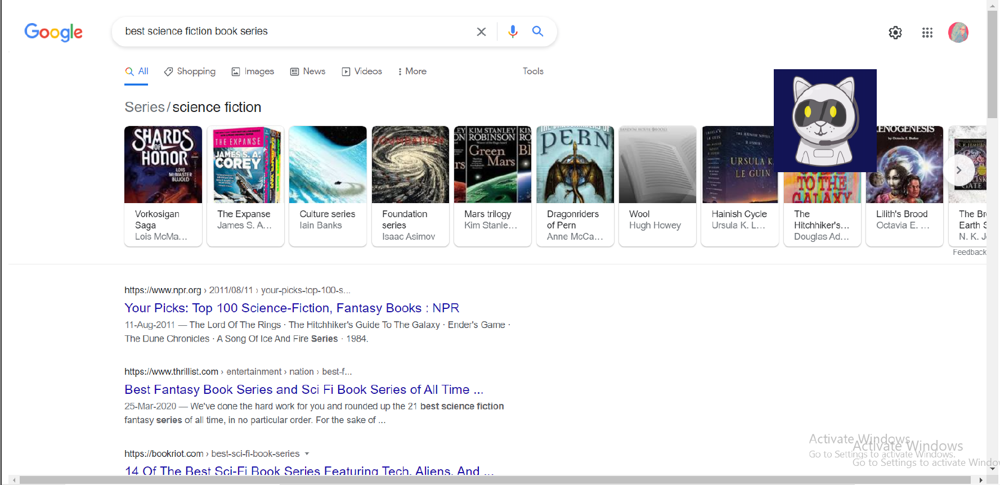
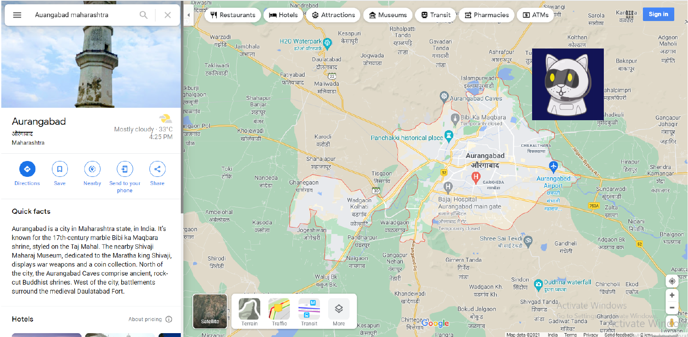

# KARA - Personal Desktop Voice Assistant

Developed with Python using Speech Recognition(Pyttsx), NLP and RNN and PyQT5 (for GUI), with features like automated web browsing, playing songs, searching particular locations on google maps, Open System Applications, providing information like weather, news, facts from wikipedia, etc.

<h4> Kara can presently be in 3 states as per user request: </h4>
<table>
  <tr>
    <th> Listening Mode </th> <th> Speaking Mode </th> <th> Sleeping Mode </th>
  </tr>
  <tr> <td></td> 
    <td>  </td> 
    <td> </td>
  </tr>
  
</table>
  

<h3> Visual Demos </h3>

<b> Google Search result for "Best science fiction book series" </b>

<b> Youtube search result for "crash course" </b>

<b> Play a song on youtube "Hey, sould sister - by Train" </b>

<b> Google maps result for - Where is "Aurangabad, Maharashtra" </b>

