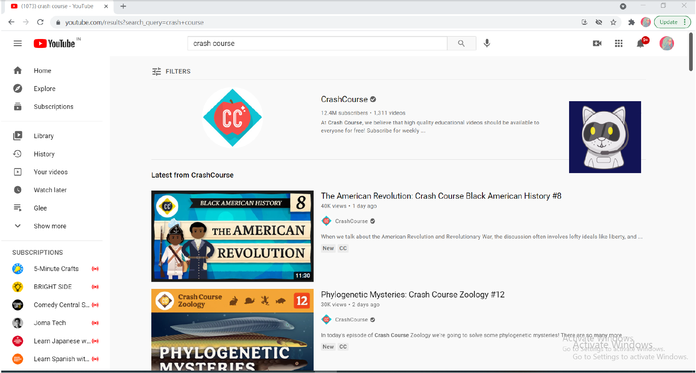

# KARA
### Personal-Desktop-Voice-Assistant
Kara - A Personal Desktop Voice Assistant developed with Python using NLP and RNN

<h4> Kara can be, presently, in 3 states as per user request: </h4>
<table>
  <tr>
    <th> Listening Mode </th> <th> Speaking Mode </th> <th> Sleeping Mode </th>
  </tr>
  <tr> <td></td> 
    <td>  </td> 
    <td> </td>
  </tr>
  
</table>
  

<h3> Visual Demos </h3>

<b> Google Search result for "Best science fiction book series" </b>

<b> Youtube search result for "crash course" </b>

<b> Play a song on youtube "Hey, sould sister - by Train" </b>

<b> Google maps result for - Where is "Aurangabad, Maharashtra" </b>

